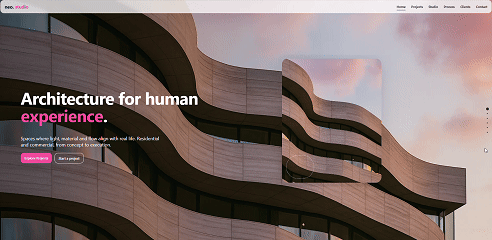

# Landing  Contabilidade (React + styled-components)
<p align="center">
  
</p>

Landing page responsiva inspirada no protótipo enviado, com foco em UI/UX.

## Stack
- React 18 + Vite
- styled-components
- Imagens geradas localmente (herói, colagem e avatares)
  
## Rodar localmente
```bash
npm install
npm run dev
# abra http://localhost:5173
```

## Build
```bash
npm run build
npm run preview
```
